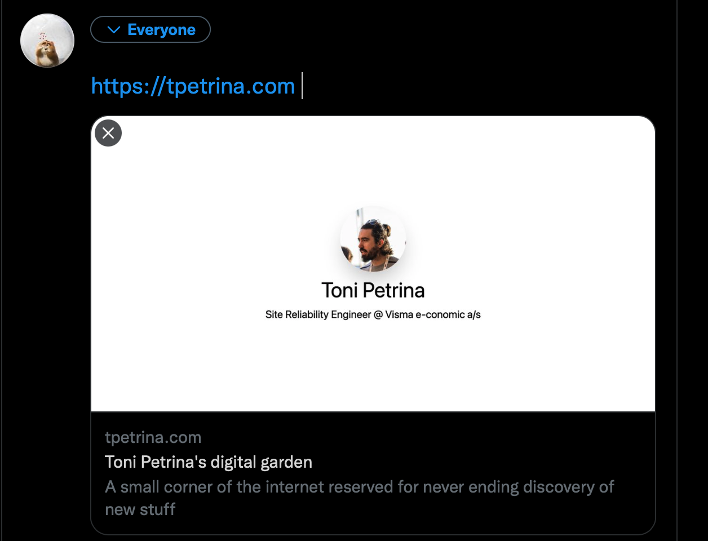

When posting a link to social media, a small preview of the link will be shown as seen on the image below. Ensuring that the preview contains relevant information for the linked page adds a little flair. And for blog posts, it would be nice if it shows information about the blog post itself.

The content of that preview can be controlled using the [Open Graph protocol](https://ogp.me/) with addition of site-specific properties. Filling title and description is straightforward from a blog post, but having a nice image is slightly trickier and requires creating one in an image editor.



Having a nice preview image is not a strong requirement, but it definitively makes links shine a bit. They could also be informative and display some relevant information, snippet or a hero image related to the link. Even though the image seen above may seem easy to create, after all it's just a photo and two lines of text, due to lack of familiarity with design tools it's a struggle. Formatting, centering, choosing a font and aligning text...these things are not trivial for someone rarely using image editors.

For this particular case I know how I wanted it to look like in terms of elements, placement and overall...somewhat rigid look and feel. The content should be centered on the image - and nicely spaced. How should one go about creating such an image? If only there is a way to use text to describe such image...

Luckily there is a nice way to describe and style such structured content: using HTML and CSS. And I _do_ know HTML and CSS. The page for the image can be seen at [banner](/banner) - the only thing to do now is to render it as an image and publish it with the blog itself.

The banner won't be updated oftan and taking a screenshot in a browser could be enough. It is simple and it works. But that is...too easy. What if I want to adjust something and then retake that screenshot? Could we...automate this?

Enter [puppeteer](https://github.com/puppeteer/puppeteer), a headless Chrome. Or more precisely, [sindresorhus/capture-website](https://github.com/sindresorhus/capture-website) - a simple wrapper for puppeteer with focus on capturing a screenshot given a URL and some parameters.

The script for it couldn't be any simpler:

```javascript
import captureWebsite from "capture-website";

await captureWebsite.file(
  "http://localhost:3000/banner",
  "public/static/images/banner.png",
  {
    overwrite: true,
    width: 1200,
    height: 630,
  }
);
```

Updating a banner is one command away: `yarn build:banner`. Itself being an alias for:

```shell
NODE_OPTIONS='--experimental-json-modules' && node ./scripts/update-banner.mjs
```

Now tweaking the banner and updating won't take too long. And this definitively opens opportunities for the future.
