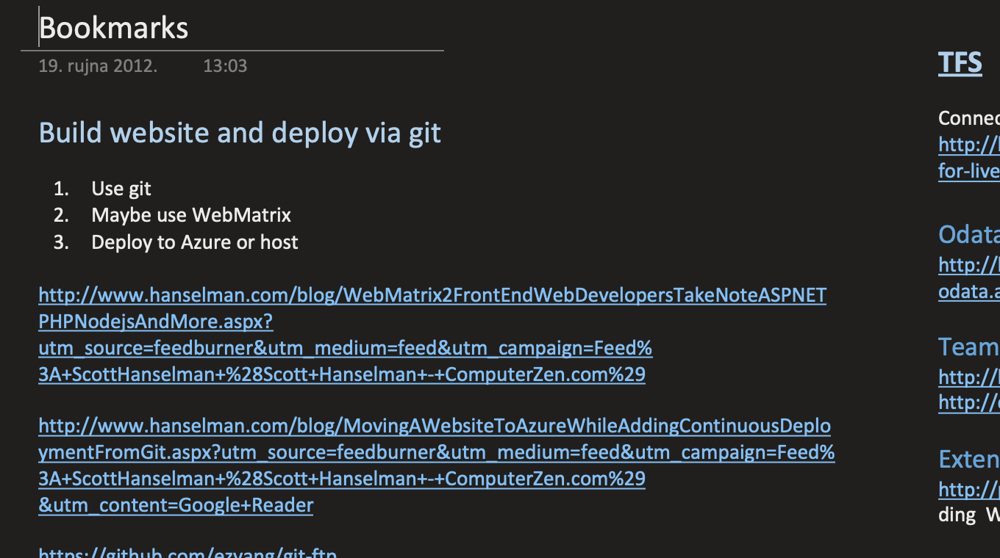
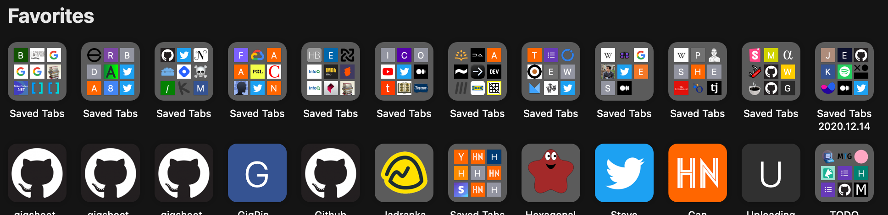

When I got my first computer in 2004, I had no internet connection at home. But soon I got access to Internet via a prepaid plan; can't remember was it based on minutes or traffic. Regardless, it was way too low for consuming a ton of content regularly. Especially on dial-up - pages were slow to load and often I would spend most of my plan which mean conservative browsing until next month.

So the solution was to simply save web pages on disk and read later. My browsing time was a race to open as many windows, as IE didn't have tabs back then, wait for them to load and save each page as a file on disk. This worked for a while, but saving PDFs or zip files with code demos was taking a toll on my plan.

Luckily, my best friend had a larger plan while my cousin had an ISDN connection. My first investment after buying the PC was buying a memory stick. A luxurious 128 MB USB stick! It allowed me to visit my friend, cousin, even school, visitations that I would use to download a bunch of pages, save them on my stick and bring them home for later reading.

Since I was learning programming and game development, all these tutorials, SIGGRAPH PDFs, demos and videos were actually being used. Of course, some tutorials were never opened - like building your OS, procedural clouds and terrain, but they were waiting for a better day.

Fast forward a couple of years and internet became a normal thing - but the habit still stayed with me. My archive was reaching into giga territory! I even discovered an app that when pointed a list of URLs would follow links and save all pages on the disk. It would even preserve links for offline access which meant entire sites could be backed up! Amazing times as I tried to download entire sites with ton of content.

But, as internet became stable and links were always accessible, the archive slowly decayed. The archive was just a thing I need to backup when reinstalling OS or changing hard drives. Instead of saving the pages I had something better - bookmarking!

At first, I had to organize them in folders for easier overview. Later I experimented with https://del.icio.us which offered tagging and categorization. An upgrade to all that was to use OneNote and combine links with descriptions, screenshots and any notes I had. Now links were no longer devoid of context, I could group them, write thoughts, reasons and goals next to them. They are becoming a knowledge base.

But links, just like files before, were rotting away. Folder with too many links meant creating new folders and subfolders. Pages in OneNote proliferated with older ones being forgotten. And switching browsers, machines, tools, and even OSes meant that all bookmarks would no longer be imported into the new browser or system. Links were forgotten.

Do I still use bookmarks? Yes, of course I do. I even paste links into Notion and still write my ideas around the links; this way some context is preserved.

But for what purpose you might ask? Bookmarks are a compromise between closing the tab, thus losing access to the information forever, or keeping the tab open until opening a browser meant 5 windows with 20+ tabs each being spawned up. Bookmarks helped me deal with chronic tab-infested browser windows by simply offloading them into permanent storage - a storage I never revisit or clean up.

> I remember when a friend visited me and asked if he could use my computer to check something. He then proceeded and killed a window with tons of open tabs because he didn't need them. Oh the horror!

Safari, Firefox and Chrome have a different slice of my browsing history preserved in layer upon layer of dead links. Thanks to cloud sync I could go in and find links about topics I no longer remember being interested into. Dead links to hosted images on various blogs or image providers...was anything of value being lost?

And yet...just today I bookmarked 16 tabs on my iPhone - just closing them would mean I would forever lose whatever intent I had when I opened them. Yet I know that the folder they are saved into is also it's gravestone.

So - why bother bookmarking? First of all, some links _are_ revisited, especially if they are needed for something I am working on. But the primary benefit is uncluttering the browser. Less tabs means less cognitive overhead, less FOMO looking at the open tabs, less distractions when I open browser to a specific thing.

> Opening a browser with tabs already open will almost certainly distract you. Whenever a browser is needed for _a task_, ensure that a fresh window is open with nothing on the start screen. No distractions ensure that the original goal will be followed.

Bookmarks _are_ necessary, even if most of them go unused or collect dust. So do our thoughts, ideas and projects. Most of them just occur once - and that's OK! After all, life is best lived forward.
