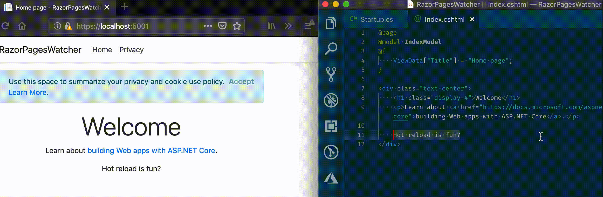

Writing Razor Pages in ASP.NET Core is easy, fast and fun. To really add to the productivity we want to have hot reload - a staple of Single Page Application frameworks like React or Vue. Let's see it in action.

<!--  -->


If the source file is changed, reload the page opened in the browser. If using split screens or multi-monitor setup, being able to see changes without switching from the editor to the browser and manually editing the file is a huge time saver.

This doesn't come out of the box with ASP.NET Core, so can we build this ourselves? The answer is a resounding - yes! So let's do it in a couple of small steps.

## The goal

The basic idea behind hot reload is simple: reload page if source file(s) change. Once we start our development server and navigate to our Razor page in the browser we want to refresh the page _if_ the file content changes. Distilled into three simple steps:

1.  Detect file changes - we will use `FileSystemWatcher`
2.  Notify open page(s) - use SignalR on the server
3.  Pages detect signal and reload themselves - use SignalR on the client

## Detect changes

Detecting changes is easy to setup.

```csharp
watcher = new FileSystemWatcher();

// Razor Pages are typically in this folder
// IHostingEnvironment env
var path = Path.Combine(env.ContentRootPath, "Pages");
watcher.Path = path;
watcher.IncludeSubdirectories = true;
watcher.Filter = "*.cshtml";
watcher.Changed += OnChanged;
// Start the actual watcher
watcher.EnableRaisingEvents = true;
```

Where will we place this code? One obvious place would be in a custom middleware that will detect changes and use SignalR on the server to force client reload.

> Note: Hot reload is a development feature and as such should not be present in the production, it should only be present in the development mode.

## Add SignalR hub

ASP.NET Core comes with a built-in support for WebSockets and with a really nice interface for building RPC style code using [Hubs](https://docs.microsoft.com/en-us/aspnet/core/signalr/hubs?view=aspnetcore-2.2).

For the purpose of hot reload we will implement a simple hub that will simply forward the message to other clients when invoked:

```csharp
public class RazorPageNotifierHub : Hub
{
    public Task Reload()
        => Clients.Others.SendAsync("Reload");
}
```

> Note: We are only interested in one way messaging from server to client.

This hub has to be registered during the initialization of the application and SignalR. Simply map the above hub when adding SignalR in the `Configure` method:

```csharp
app
    .UseSignalR(route =>
    {
        route.MapHub<RazorPageNotifierHub>("/razorpagenotifierhub");
    })
```

## Notifying change

We haven't implemented the above mentioned `OnChanged` handler - let's do that now. If one of the file changes, we need to send message_from the server to the client in the backend code.

To do that we will use the built in interface `IHubContext<RazorPageNotifierHub> hubContext` which is obtained through the built in dependency injection. Once obtained, sending message from server is done using the following line:

```csharp
await hubContext.Clients.All.SendAsync("Reload");
```

## The client part

Page reload is easy - simply call `location.reload()` when needed. Since the server will send the message through the SignalR Hub, we need to subscribe to it in the client code. Add the following code to either `_Layout.cshtml` or page you are interested in (this code should ideally be in some tag helper, but this is PoC, not production :).

```html
<!-- Let's use CDN version of SignalR js client here -->
<script src="@Url.Content("https://cdn.jsdelivr.net/npm/@aspnet/signalr@1.1.0/dist/browser/signalr.js")"></script>
<script>
    var connection = new signalR.HubConnectionBuilder().withUrl("/razorpagenotifierhub").build();

    connection.on("Reload", function () {
        location.reload(true);
    });

    connection
        .start()
        .catch(function (err) {
            return console.error(err.toString());
        });
</script>
```

## Takeaway notes

This is obviously not a production ready code but more of a proof of concept. In some cases the page is reloaded, but the changes are not picked up from the server - this needs to be investigated. Also, this code should be packaged up properly and distributed as NuGet package.

If the project is already using SignalR, hubs need to be merged and client code simplified. But that is more of an exercise for the reader.

Project and all code can be found on Github: [tpetrina/blogsample-razorpagesreload](https://github.com/tpetrina/blogsample-razorpagesreload).
