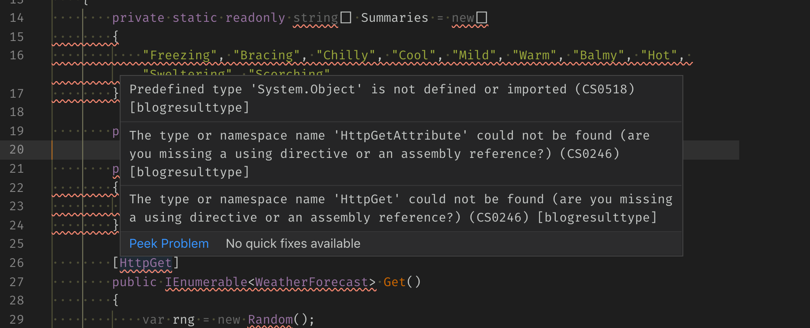

Visual Studio Code on macOS has small issues with .NET Core 3 projects. To be more precise, Omnisharp extension has certain issues. If you have red squiggles all over your code like in the image below, don't despair - there is a workaround.



As per [instructions by `filipw`](https://github.com/OmniSharp/omnisharp-vscode/issues/3290#issuecomment-536604319) in the GitHub issue, open _User settings as JSON_ and paste the following line:

```
    "omnisharp.path": "1.34.4-beta.34"
```

Restart Omnisharp and voila, the errors are gone!

Happy coding.
