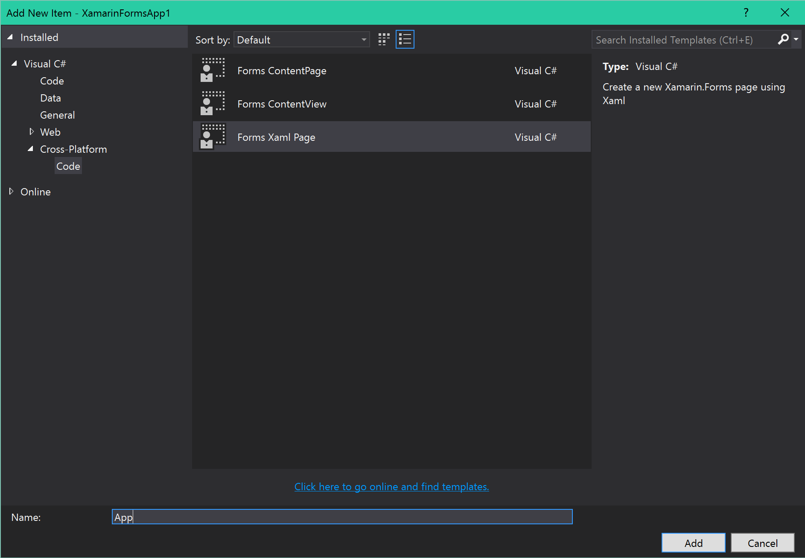

When creating a new Xamarin.Forms blank app. the default template creates a code based `Application` class in the PCL project. Since this is just a C# class, to add global styles and resources you must add those in code. Creating styles in XAML is preferable to writing them in code. Adding global objects for binding like `ViewModelLocator` for MVVMLight and common converters is also nicer to do in XAML. Luckily, we can add the missing XAML part of this class quickly.

Once you project is created, delete the `App.cs` file in the PCL project and go through the Add New Item wizard and add new Forms Xaml Page with the name App.



This will create a new page and we need to fix it a bit first. After creation, the page `App.xaml` file contains the following:

```xml
<?xml version="1.0" encoding="utf-8" ?>
<ContentPage xmlns="http://xamarin.com/schemas/2014/forms"
             xmlns:x="http://schemas.microsoft.com/winfx/2009/xaml"
             x:Class="XamarinFormsApp1.App">
    <Label Text="{Binding MainText}" VerticalOptions="Center" HorizontalOptions="Center" />
</ContentPage>
```

Remove the inner content and replace the top level element with `Application`. Since we want to be able to define resources in the XAML, we should also add a `ResourceDictionary` to the `Resources` property. File should now look like:

```xml
<?xml version="1.0" encoding="utf-8" ?>
<Application xmlns="http://xamarin.com/schemas/2014/forms"
             xmlns:x="http://schemas.microsoft.com/winfx/2009/xaml"
             x:Class="XamarinFormsApp1.App">

    <Application.Resources>
        <ResourceDictionary>

        </ResourceDictionary>
    </Application.Resources>

</Application>
```

Now we need to fix the backing code for the newly created `App` class. Open `App.xaml.cs` file and change the base class from `ContentPage` to `Application`. File should resemble the following code:

```csharp
using Xamarin.Forms;

namespace XamarinFormsApp1
{
    public partial class App : Application
    {
        public App()
        {
            InitializeComponent();

            MainPage = /* create main page here */;
        }
    }
}
```

And that's it, you can now easily add global resources and styles to the `App.xaml`.
