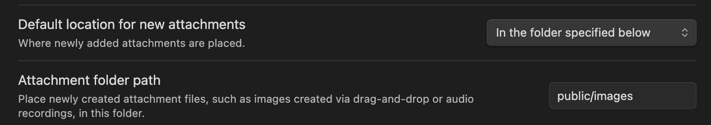

Obsidian settings for images:

File path is `../../../public/images/obsidian-image-settings.png`, but Next.js will serve the file under `/images/obsidian-image-settings.png`.
## Custom renderer

Add `image.markdoc.ts` to the `markdoc` folder used for customizing Markdoc (export it from `index.ts` too) with the following code:

```tsx
import { nodes } from "@markdoc/markdoc";
import Image from "../../components/image.tsx";

export default {
  ...nodes.image,
  render: Image,
};
```

The link component:
```tsx
type ImageProps = {
  src: string;
  alt?: string;
  title?: string;
};

export default function Image({ src, ...props }: ImageProps) {
  // Fix src and remove everything before public
  const fixedSrc = src.substring(src.indexOf("public") + "public".length);

  return ;
}
```