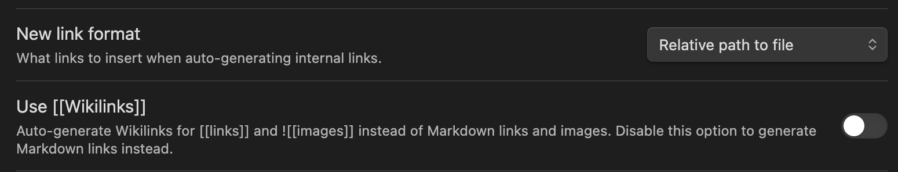

The following Obsidian settings are used for links:

The links contain file extension `.md` which breaks when rendered in the browser. Luckily, this can be easily override.

## Custom Link rendering

Add `link.markdoc.ts` to the `markdoc` folder used for customizing Markdoc (export it from `index.ts` too) with the following code:
```tsx
import { link } from "@markdoc/next.js/tags";
import Link from "../../components/link.tsx";

export default {
  ...link,
  render: Link,
};
```

The link component:
```tsx
import NextLink from "next/link";

type LinkProps = {
  href: string;
  title?: string;
};

export default function Link({ href, ...props }: LinkProps) {
  const fixedHref = href.toString().replace(".md", "");

  return <NextLink href={fixedHref} {...props} />;
}
```