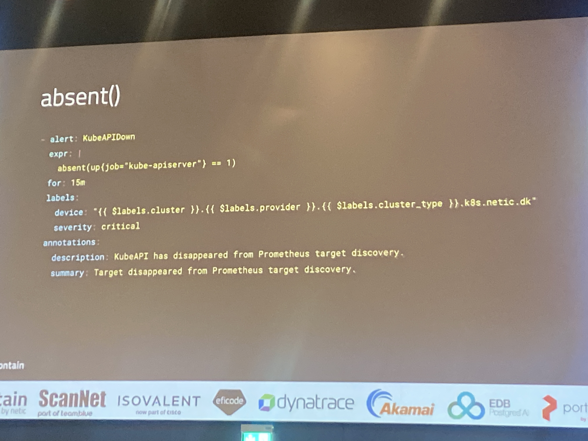
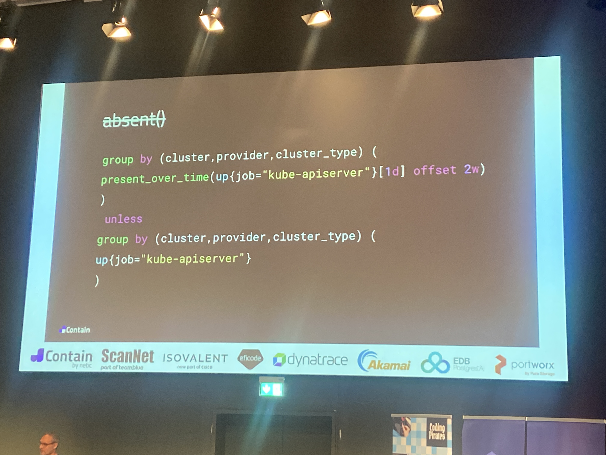

Investigate tech:
-  Mimir
- Pint - linter by cloudflare

Alert manager

The human element is the dominant element to solve. Devops is result of that. As we have to solve human problems, not just technical.

Struggle between returning back to the good old and simple times, but some treat it as a computer game. Tools were simpler and the new tools aren’t as good as we think. We also engage in “team support” for tools. Tribalism

Meta: “A lot of villagers a city does not make” there is a limit in using metaphors when condemning modern solutions. Sometimes the simplicity of presentation can be misleading as it intentionally hides certain messy parts. 

Meta: bad pop culture references ruin presentation 

We build smaller systems so that are smaller and self contained. Q: what is gained by this? What is gained by using IAM permissions over coded ones?

  

ttl.sh - ephemeral storage for demos. OCI

DevEx!=platform engineering 

  

  

  

  

WESL (weasel) = Windows Enterprise Standard Laptop

  

  

https://taskfile.dev/