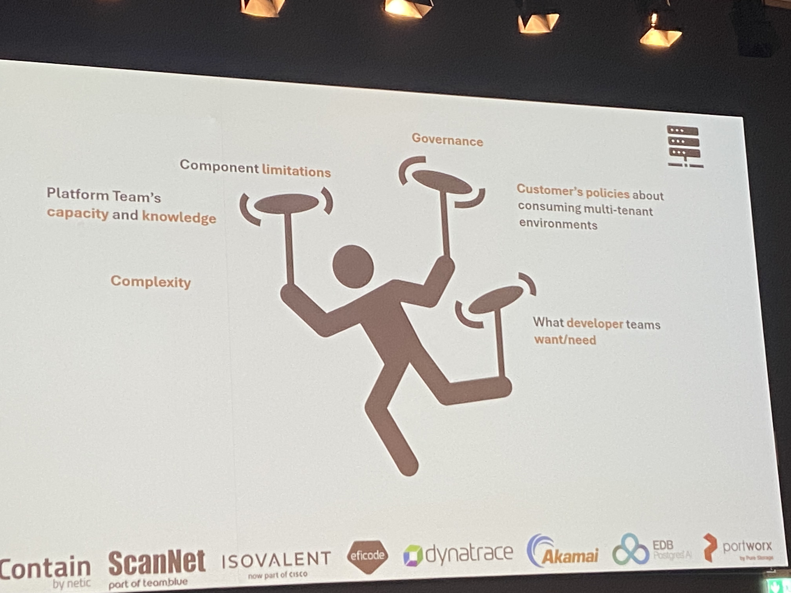
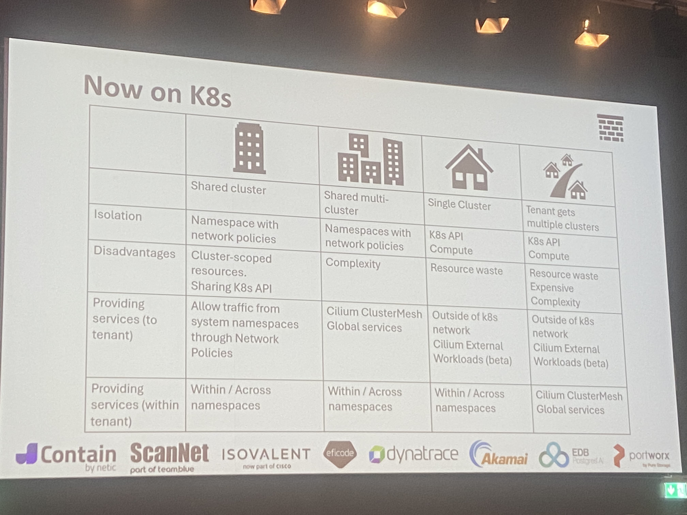
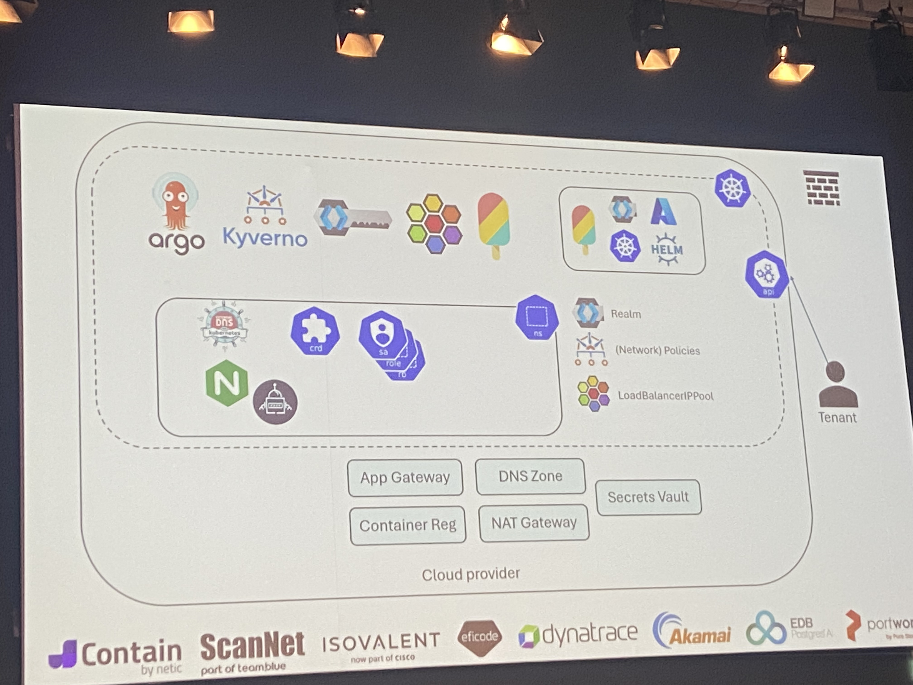

Batch job and queues can be done in k8s nowadays
See also: [Vulcano](https://www.cncf.io/projects/volcano/), [Armada](https://www.cncf.io/projects/armada/).

[CloudNativePG](https://cloudnative-pg.io/documentation/1.24/)

## Running Apache Kafka at scale on Kubernetes with Strimzi​

Apache Kafka on K8s - https://strimzi.io/
OpenAPI schema for ordering Kafka topic, a db, etc.
DevEx -> Orchestration -> Shared services -> Resources
## Platform Real State: Abstract Your Organization's Tenancy Model Away With Crossplane

Saving costs, sharing infra, reducing noisy neighbour.
Check:
* What infra and app services tenants need
	* Inventorizing - find out what is required
	* App devs need
		* GitOps, auth, secrets, DNS, expose endpoints
		* Keycloak, external-dns, ArgoCD, ingress-nginx
	* Platform team needs
		* Create stuff outside of k8s, DNS, isolation, RBAC, GitOps
		* Kyverno, Crossplane
* What scale
	* Difference between small and large tenants
	* Limitations due to resources you use (LBs, number of pods)
	* Dedicated/shared
* Isolation
	* Compute, network, control panel, middleware (tools, app services)
* How much k8s is visible
	* Simplifies GitOps on non-k8s resources
	* Custom CRD that masquerades as a Helm chart
* Efficiency
	* 

## Saxo
Create blueprints for services
Reduce number of approvals you need
Developers like GitOps - restore entire cluster from git
Blueprint components:
* Everything is in YAML
* CRDs and operators
Backstage format for blueprints

Operator is in .NET https://github.com/buehler/dotnet-operator-sdk?

Meta: what is the point of reporting "this piece is missing" when using declarative infra? Shouldn't everything be reconciled anyway and minimize the number of such errors?