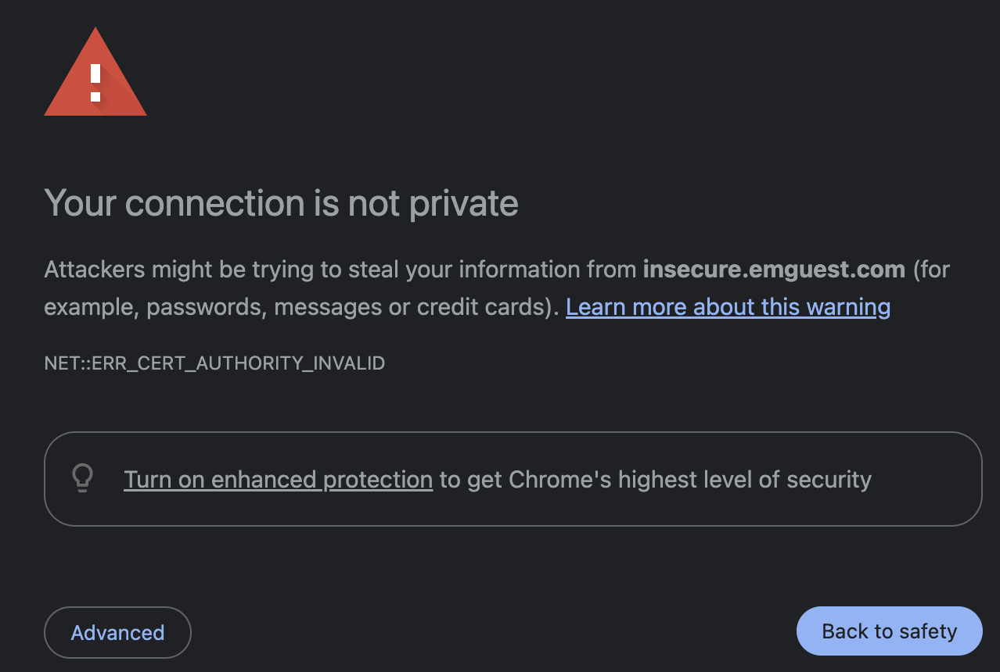

While testing large file upload, I noticed a very strange 413 error. Strange, this must be some nginx file size limit, I've dealt with this before. The app was previously deployed to Azure App Services and everything worked fine, the largest uploaded file was around 700 MB. This app was being migrated to Kubernetes so it must be ingress settings to change:

```yaml
nginx.ingress.kubernetes.io/proxy-body-size: 2048m
```

Still the same error. Checking the error page again, I noticed the word "Cloudflare" in the footer instead of the usual "nginx". After googling if this is a common issue, I found this [forum post](https://community.cloudflare.com/t/max-upload-size/630925) containing an explanation: Cloudflare limits file size when proxied. Since I am on the free plan and not planning to change anytime soon, there has to be some workaround.

## Split out upload endpoint without orange cloud

The workaround works as following: create a second DNS entry `upload.domain.com` that skips the orange cloud. Point it to the same IP address as the `app.domain.com`, but create a separate ingress rule just for this endpoint:

```yaml
apiVersion: networking.k8s.io/v1
kind: Ingress
spec:
  ingressClassName: nginx
  rules:
    - host: upload.domain.com
      http:
        paths:
          - pathType: Prefix
            path: /api/upload
    - host: app.domain.com
      http:
        paths:
          - pathType: Prefix
            path: /
```

Both subdomains use the same service and the same deployment, but we use DNS to separate them. Luckily, there is only one such endpoint, but if there were more, it would merely complicate the above YAML.
For the first time on this entire project/domain, I don't have the orange cloud icon. It's both funny and ... concerning how used I became to Cloudflare, but I guess this is a workaround for this single use-case.


## Certificate issues

However, simply bypassing the orange cloud exposed another issue: self-signed certs.


Relying on Cloudflare exposed another weakness: I don't have proper strict SSL/TLS configuration, I only have Full configuration for this domain. Cloudflare will happily hide this fact (and my k8s IP too) from my end users.

Time to install cert-manager and configure it for this domain! A couple of hours later this is resolved and all browsers are happy with accessing `upload.domain.com`.

## Cookies and subdomains

Upload still doesn't work! Since I am using cookie authentication on the `app.domain.com`, every call to `upload.domain.com` redirects to login. This shouldn't happen, I am on the same domain, right?

This part is ASP.NET Core specific, but the solution is to set the domain for the cookies:

```csharp
services.ConfigureApplicationCookie(options =>
{
    options.Cookie.Domain = ".emguest.com";
});
```

And now upload works like a charm (after cleaning cookies and whatnot).

Alternative solution would be to use some kind of short-lived shared access token for the upload endpoint and use a separate application for uploading that doesn't rely on cookies and same auth as the primary application. This app would only be used for file upload. Upon completion, it would return the URL or notify the main app via backchannel. This separation would prevent any accidental leaks, but it would involve creating this whole new app/setup which is more than I need at the moment.

This completes the workaround for large file upload when using Cloudflare.
